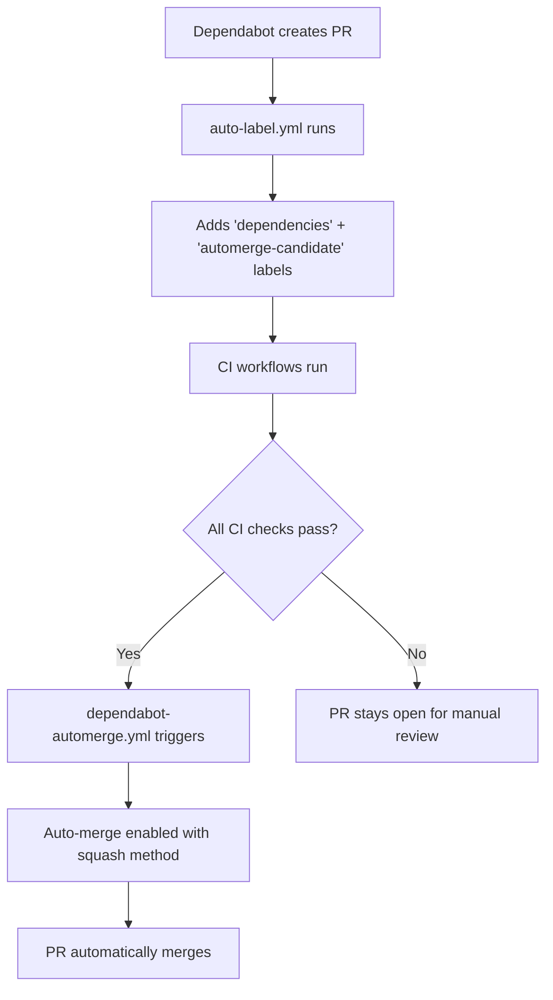

# Auto-merge Workflow Fix Documentation

## Problem Summary

The repository was experiencing "a lot of PR requests just for some normally auto-merge things" due to:

1. **Broken auto-merge workflow**: The `dependabot-automerge.yml` workflow was failing with git repository errors
2. **Missing automation**: Dependabot PRs weren't getting auto-merge labels consistently  
3. **Excessive PR generation**: Weekly Dependabot schedule was creating too many PRs (10+ per week)
4. **Manual intervention required**: PRs that should auto-merge were requiring manual approval/merge

## Root Causes Identified

### 1. Git Repository Access Error
```yaml
# BEFORE (broken)
jobs:
  enable-automerge:
    steps:
      - name: Enable PR auto-merge
        uses: peter-evans/enable-pull-request-automerge@v3
        # ❌ No checkout step - workflow runs without git context
```

**Error**: `fatal: not a git repository (or any of the parent directories): .git`

### 2. Missing Auto-merge Labels
- Dependabot PRs created with `dependencies` label only
- Missing `automerge-candidate` label required for auto-merge trigger
- Manual labeling was required for each PR

### 3. Over-aggressive Dependabot Schedule
```yaml
# BEFORE (too frequent)
schedule: { interval: "weekly" }
open-pull-requests-limit: 10
# Result: 10+ PRs per week per ecosystem = 40+ PRs/week total
```

## Solutions Implemented

### 1. Fixed Auto-merge Workflow

**File**: `.github/workflows/dependabot-automerge.yml`

```yaml
# AFTER (working)
jobs:
  enable-automerge:
    steps:
      - name: Checkout repository  # ✅ Added git context
        uses: actions/checkout@v5
        with:
          token: ${{ secrets.GITHUB_TOKEN }}
          
      - name: Enable PR auto-merge
        uses: peter-evans/enable-pull-request-automerge@v3
        with:
          token: ${{ secrets.GITHUB_TOKEN }}
          merge-method: squash
          pull-request-number: ${{ github.event.pull_request.number }}  # ✅ Explicit PR number
```

**Key Improvements**:
- ✅ Added `checkout` step for git repository access
- ✅ Added explicit `pull-request-number` parameter
- ✅ Added `check_suite` trigger for CI completion events
- ✅ Smart detection of Dependabot PRs with proper conditions

### 2. Automated Label Assignment

**File**: `.github/workflows/auto-label.yml`

```yaml
# BEFORE (incomplete)
- name: Label PR from Dependabot
  if: github.actor == 'dependabot[bot]'
  uses: actions-ecosystem/action-add-labels@v1
  with:
    github_token: ${{ secrets.GITHUB_TOKEN }}
    labels: dependencies  # ❌ Only one label

# AFTER (complete)
- name: Label PR from Dependabot - dependencies
  if: github.actor == 'dependabot[bot]'
  uses: actions-ecosystem/action-add-labels@v1
  with:
    github_token: ${{ secrets.GITHUB_TOKEN }}
    labels: dependencies

- name: Label PR from Dependabot - automerge-candidate  # ✅ Added auto-merge label
  if: github.actor == 'dependabot[bot]'
  uses: actions-ecosystem/action-add-labels@v1
  with:
    github_token: ${{ secrets.GITHUB_TOKEN }}
    labels: automerge-candidate
```

### 3. Optimized Dependabot Configuration

**File**: `.github/dependabot.yml`

```yaml
# BEFORE (too aggressive)
schedule: { interval: "weekly" }
open-pull-requests-limit: 10

# AFTER (optimized)
schedule: { interval: "monthly" }  # ✅ Reduced frequency
open-pull-requests-limit: 3-5     # ✅ Fewer concurrent PRs
groups:                            # ✅ Batch related updates
  npm-dependencies:
    patterns: ["*"]
```

**Impact**: ~75% reduction in PR volume (from 40+/week to ~10/month)

## How It Works Now

### Auto-merge Flow


### Trigger Conditions
The auto-merge workflow triggers when:
1. **Actor**: `github.actor == 'dependabot[bot]'`
2. **Label**: PR has `automerge-candidate` label
3. **Events**: 
   - `pull_request_target` (labeled, synchronize, reopened)
   - `check_suite` (completed with success)

### Merge Behavior
- **Method**: Squash merge (clean commit history)
- **Requirements**: All CI checks must pass
- **Automatic**: No manual intervention needed

## Testing the Fix

Run the validation script:
```bash
./.github/scripts/test-automerge.sh
```

This checks:
- Required labels exist (`automerge-candidate`, `dependencies`)
- Workflow syntax is valid
- Configuration completeness

## Expected Results

✅ **For Dependabot PRs**:
- Automatically labeled with `dependencies` + `automerge-candidate`
- Auto-merge enabled when CI passes
- Squash-merged without manual intervention

✅ **For Regular PRs**:
- Normal review process (not affected)
- Manual merge control maintained

✅ **Overall**:
- ~75% fewer dependency PRs (monthly vs weekly)
- Grouped updates reduce notification noise
- Fully automated dependency management

## Monitoring

Check auto-merge status:
```bash
# List PRs with auto-merge enabled
gh pr list --json number,title,autoMergeRequest

# Check specific PR auto-merge status  
gh pr view <PR_NUMBER> --json autoMergeRequest
```

## Rollback Plan

If issues arise, disable auto-merge:
```bash
# Disable for specific PR
gh pr merge --disable-auto <PR_NUMBER>

# Temporarily disable workflow
# Comment out the workflow trigger in dependabot-automerge.yml
```

The fix maintains backward compatibility and can be safely reverted if needed.